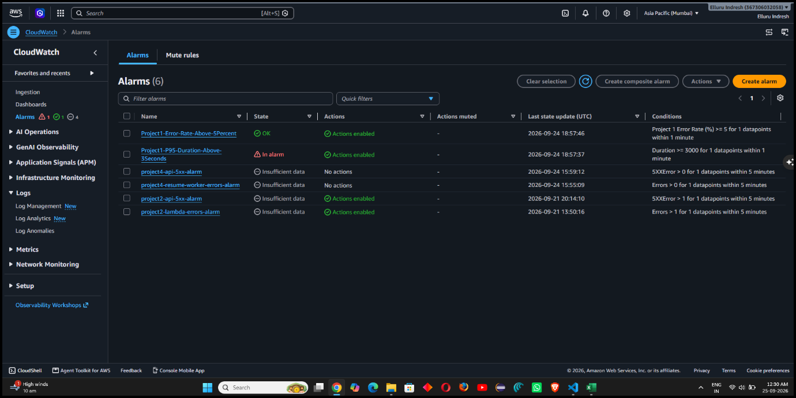

# Project 1 – Alarm Runbook & Incident Response

## Project

**Employee Onboarding Demo Project**

This runbook documents the alerting and incident-response configuration implemented for Project 1 as part of the Production Hardening, Observability & Cost Optimisation Sprint.

> **Note:** The original Project 1 AWS resources had previously been removed. A validation Lambda named `project1-alarm-test` was created in `ap-south-1` to validate the required CloudWatch alarm, metric evaluation, and SNS notification behavior.

---

## 1. Alerting Architecture

```text
project1-alarm-test Lambda
        │
        ├── Errors / Invocations (>= 5%)
        │       │
        │       ▼
        │   Error Rate Alarm
        │
        └── Duration P95 (>= 3s)
                │
                ▼
          P95 Duration Alarm
                │
                ▼
        Amazon CloudWatch
                │
                ▼
          Amazon SNS Topic
          `project1-alarms`
                │
                ▼
       Email Notification
```

---

## 2. CloudWatch Alarms & Metric Thresholds

| Alarm Name | Monitored Metric | Evaluation Period | Threshold | Notification Target | Severity |
|---|---|---|---|---|---|
| `project1-error-rate-alarm` | `Errors / Invocations` | 1 evaluation period (5 min) | `>= 5%` | `project1-alarms` (SNS) | High / P2 |
| `project1-p95-duration-alarm` | `Duration (p95)` | 1 evaluation period (5 min) | `>= 3.0 s (3000 ms)` | `project1-alarms` (SNS) | Critical / P1 |

### Alarm 1: Error Rate Alarm
Monitors execution failures and unexpected exceptions across Lambda invocations. Configured to alert when error percentage exceeds 5%.


### Alarm 2: P95 Duration Alarm
Monitors latency degradation and execution bottlenecks. Fires when 95% of requests take 3 seconds or longer.



---

## 3. SNS Notification Target Configuration

- **Topic Name:** `project1-alarms`
- **Region:** `ap-south-1`
- **Subscription Protocol:** Email
- **Status:** Confirmed


---

## 4. Incident Triage Procedures

### Alert: Error Rate Spike (`project1-error-rate-alarm`)
1. **Acknowledge Alert:** Check SNS email alert timestamp and error count.
2. **Inspect CloudWatch Logs:**
   ```bash
   aws logs filter-log-events \
     --log-group-name "/aws/lambda/project1-alarm-test" \
     --filter-pattern "ERROR" \
     --start-time $(date -u -d '15 minutes ago' +%s000)
   ```
3. **Check Dependent Resources:** Verify DynamoDB throughput and Step Functions workflow execution limits.
4. **Remediate:** If unhandled runtime exceptions occur, revert to the last stable deployment artifact or deploy an urgent hotfix.

### Alert: High P95 Duration (`project1-p95-duration-alarm`)
1. **Analyze Traces:** Inspect execution durations and identify cold-starts vs. downstream API call delays.
2. **Review Memory & CPU Allocation:** Check if memory sizing is insufficient, causing CPU throttling.
3. **Remediate:** Adjust provisioned concurrency or memory allocation in 256MB increments to optimize duration.

---

## 5. Alarm Recovery & Verification

- **Alarm Simulation:** Synthetic errors and latency-injected invocations were executed to force state transition from `OK` to `ALARM`.
- **Notification Verification:** SNS delivered automated alert emails to the subscribed endpoint upon threshold breach.
- **Auto-Recovery:** Following test completion, CloudWatch metric evaluation confirmed automatic recovery back to `OK` state.