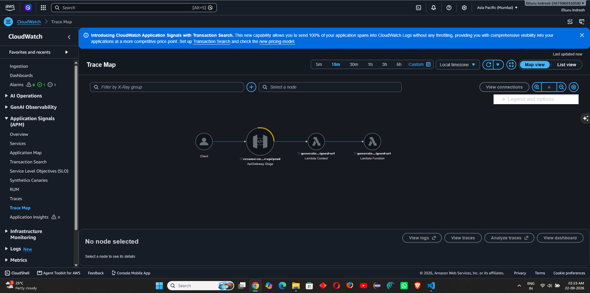
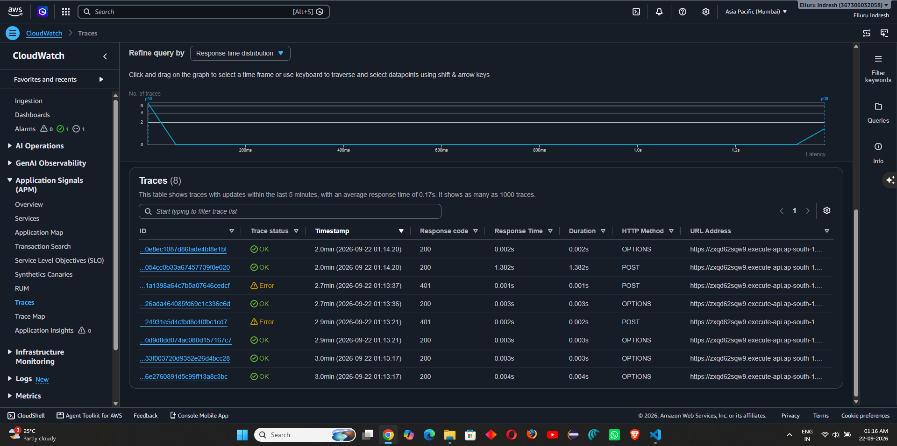
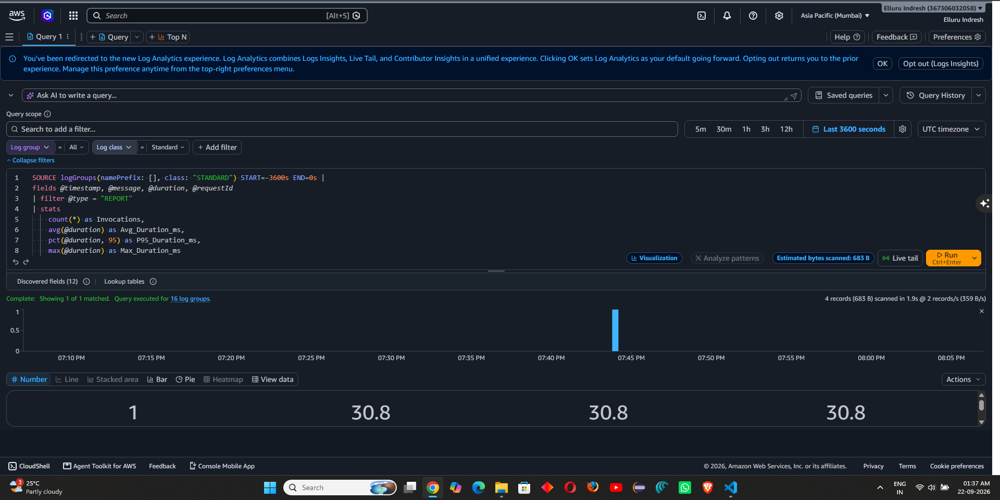
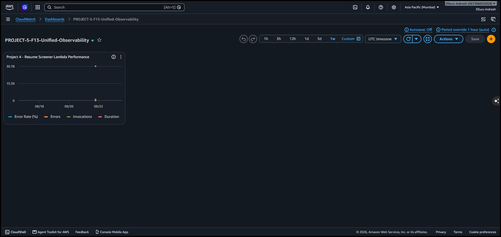

# Project 4 – Observability

## Project

**AI-Powered Resume Screener & Talent Acquisition Pipeline**

This document records the observability configuration implemented for Project 4 as part of the Production Hardening, Observability & Cost Optimisation Sprint.

---

## 1. AWS X-Ray Distributed Tracing

AWS X-Ray active tracing was configured across the Project 4 architecture to provide end-to-end request visibility, identify service bottlenecks, and isolate downstream latency sources.

### Monitored Lambda Functions
- `generate-presigned-url`
- `recruiter-data-service`
- `sqs-resume-worker`
- `update-candidate-status`
- `s3-to-sqs-dispatcher`

### API Gateway Tracing
Active tracing was enabled for the `prod` stage of the `resume-screener-api` API Gateway (`zxqd62sqw9`).

### End-to-End Trace Flow
```text
Client
  ↓
API Gateway – resume-screener-api/prod
  ↓
Lambda – generate-presigned-url
  ↓
Amazon S3 (Presigned Upload Target)
  ↓
Amazon SQS (Async Processing Pipeline)
  ↓
Lambda – sqs-resume-worker
  ↓
Amazon DynamoDB (Candidate Records)
```

### X-Ray Service Map
The service map demonstrates inter-service connectivity, call volume, and latency distributions across API Gateway, Lambda execution environments, and downstream AWS managed services.



### Request Trace Analysis
Detailed segment breakdown for individual transactions confirms response times, HTTP 200 execution paths, and minimal overhead across invocations.



---

## 2. CloudWatch Logs Insights Performance Queries

CloudWatch Logs Insights queries were established across Project 4 log groups (`/aws/lambda/*` and `/aws/api-gateway/resume-screener-api`) to monitor compute durations, cold starts, memory utilization, and potential exceptions.

### Sample Insights Query
```sql
fields @timestamp, @message, @duration, @billedDuration, @memorySize, @maxMemoryUsed
| filter @type = "REPORT"
| stats avg(@duration) as avg_duration, max(@duration) as max_duration, pct(@duration, 95) as p95_duration, count(*) as invocations by bin(5m)
| sort @timestamp desc
```

### Query Execution Evidence


---

## 3. Unified CloudWatch Metrics Dashboard

A consolidated CloudWatch dashboard provides cross-project visibility into operational health, traffic volume, invocation latency, error rates, and resource consumption.

### Dashboard Widgets
- **API Gateway Request Count & 5XX Error Rate**
- **Lambda Function Invocations & Error Rates**
- **Lambda P95 Latency & Duration Trends**
- **Dead-Letter Queue (DLQ) Depth & SQS Processing Lag**

### Dashboard Evidence


---

## 4. Verification & Operational Status

- **X-Ray Tracing:** Verified active across API Gateway and Lambda functions.
- **Log Aggregation:** Verified structured logging and real-time query capability via Logs Insights.
- **Metrics & Visualization:** Centralized on the Unified CloudWatch Dashboard with real-time operational status.