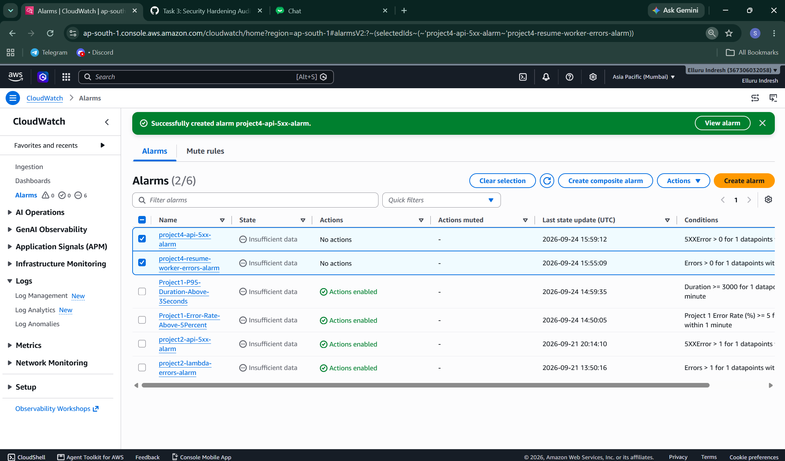

# Incident Management & Operational Runbook: Project 4 (AI Resume Screener & Talent Pipeline)

## 1. System Overview & Architecture
Project 4 provides automated candidate resume intake, text extraction, and entity scoring:
- **API Gateway (`resume-screener-api`):** Authenticated intake endpoints protected via Cognito User Pool authorizers.
- **S3 Bucket (`resume-screener-raw-resumes-*`):** Encrypted object store for candidate CVs and parsed artifacts.
- **SQS Queue & Worker (`sqs-resume-worker`):** Decoupled processing pipeline triggering text analysis and entity scoring.
- **Amazon Textract & Comprehend:** Automated text parsing and skill matching.
- **DynamoDB (`resume-screener-candidates`):** Encrypted persistent store for candidate evaluations.

---

## 2. CloudWatch Alarms Baseline & Thresholds

| Alarm Name | Monitored Resource | Metric | Evaluation Period | Threshold | Severity |
|---|---|---|---|---|---|
| `project4-resume-worker-errors-alarm` | Lambda (`sqs-resume-worker`) | `Errors` | 1 datapoint within 5 min | Sum > 0 | High / P2 |
| `project4-api-5xx-alarm` | API Gateway (`resume-screener-api`) | `5XXError` | 1 datapoint within 5 min | Sum > 0 | Critical / P1 |

### Alarm Verification Evidence


---

## 3. Incident Triage Procedures

### Alert 1: `project4-resume-worker-errors-alarm` Triggered
- **Symptom:** Resume worker Lambda execution failure, potential SQS poison message loop.
- **Triage Steps:**
  1. Inspect recent Lambda invocation logs in CloudWatch:
     ```bash
     aws logs filter-log-events \
       --log-group-name "/aws/lambda/sqs-resume-worker" \
       --filter-pattern "ERROR" \
       --start-time $(date -u -d '15 minutes ago' +%s000)
     ```
  2. Verify Textract and Comprehend service quotas and IAM permission validation.
  3. Check dead-letter queue (DLQ) depth for unprocessable binary payloads:
     ```bash
     aws sqs get-queue-attributes \
       --queue-url <DLQ_URL> \
       --attribute-names ApproximateNumberOfMessages
     ```
- **Remediation:**
  - Redrive non-malformed failed messages once parsing errors are corrected.
  - Scale Lambda concurrency limits if throttling is detected.

---

### Alert 2: `project4-api-5xx-alarm` Triggered
- **Symptom:** Recruiter or applicant requests receive HTTP 500/502/504 errors on API endpoints.
- **Triage Steps:**
  1. Inspect API Gateway execution access logs:
     ```bash
     aws logs tail /aws/api-gateway/resume-screener-api --follow
     ```
  2. Confirm Cognito Authorizer availability and token validation latency.
  3. Verify backend integration endpoints and ensure target Lambda/S3 permissions are intact.
- **Remediation:**
  - If integration timeouts occur, optimize backend cold starts and provisioned concurrency.
  - Redeploy API stage if deployment drift or misconfigured authorizer mappings occurred.

---

## 4. Post-Incident Review Checklist
- [ ] Alarm acknowledged and communicated on engineering Slack/Discord channels.
- [ ] Root cause identified (e.g., malformed payload, IAM denial, downstream API rate-limiting).
- [ ] Data consistency audited across DynamoDB tables and S3 intake objects.
- [ ] Corrective action items documented in Jira/GitHub issue tracker.
- [ ] Alarm threshold and evaluation window calibrated to minimize false positives.
