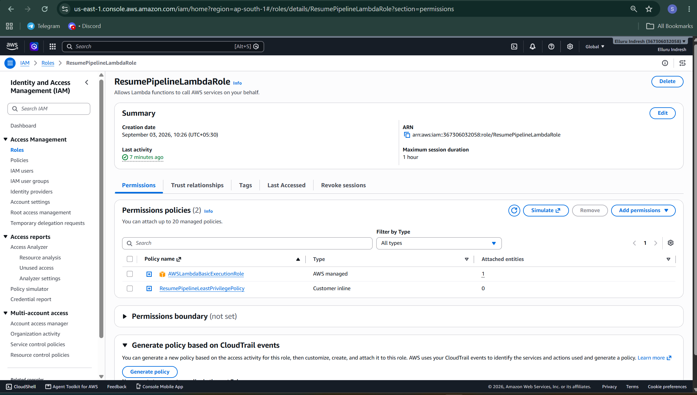
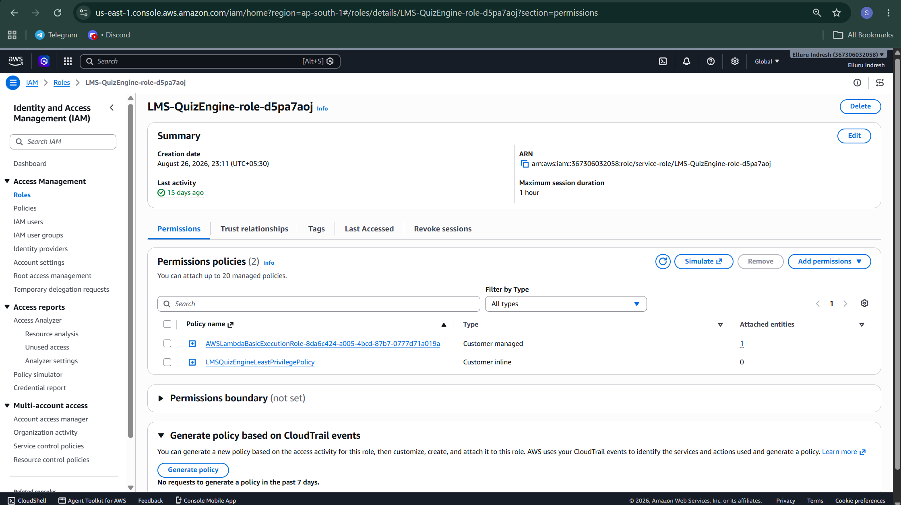
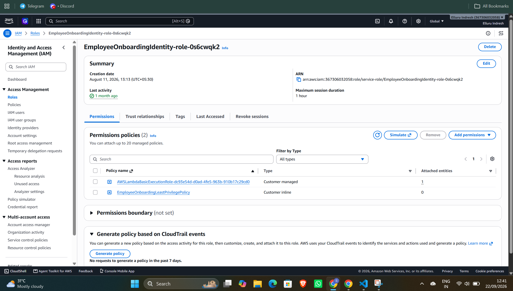

# Security Hardening: IAM Least-Privilege Policy Audit

This document details the security posture review and least-privilege remediation executed across the microservices. Over-permissive full-access AWS managed policies were revoked and replaced with granular, ARN-scoped inline permissions.

---

## Project 4: AI Resume Screener & Talent Acquisition Pipeline
* **Role Name:** ResumePipelineLambdaRole
* **Role ARN:** arn:aws:iam::367306032058:role/ResumePipelineLambdaRole

### Verification Evidence


### Before Hardening (Over-Permissive / Wildcard Full Access)
The role was initially configured with 6 broad AWS-managed policies granting unrestricted account-wide access (* actions on * resources):
- AmazonDynamoDBFullAccess
- AmazonS3ReadOnlyAccess
- AmazonSQSFullAccess
- AmazonTextractFullAccess
- AWSLambdaBasicExecutionRole
- ComprehendFullAccess

### Vulnerability & Risk Identified
1. **Unrestricted DynamoDB & S3 Access:** Allowed arbitrary reading, updating, and dropping of any table or storage bucket in the AWS account.
2. **Excessive Administrative Privileges:** Permitted destructive queue and table management operations outside the Lambda execution boundary.

### Hardened Least-Privilege Inline Policy (After)
```json
{
  "Version": "2012-10-17",
  "Statement": [
    {
      "Sid": "LambdaCloudWatchLogs",
      "Effect": "Allow",
      "Action": [
        "logs:CreateLogGroup",
        "logs:CreateLogStream",
        "logs:PutLogEvents"
      ],
      "Resource": "arn:aws:logs:*:367306032058:log-group:/aws/lambda/*"
    },
    {
      "Sid": "S3ResumeBucketReadOnly",
      "Effect": "Allow",
      "Action": [
        "s3:GetObject"
      ],
      "Resource": "arn:aws:s3:::*resume*/*"
    },
    {
      "Sid": "DynamoDBCandidateTableAccess",
      "Effect": "Allow",
      "Action": [
        "dynamodb:PutItem",
        "dynamodb:GetItem",
        "dynamodb:UpdateItem",
        "dynamodb:Query"
      ],
      "Resource": "arn:aws:dynamodb:*:367306032058:table/*"
    },
    {
      "Sid": "SQSResumeQueueProcessing",
      "Effect": "Allow",
      "Action": [
        "sqs:ReceiveMessage",
        "sqs:DeleteMessage",
        "sqs:GetQueueAttributes"
      ],
      "Resource": "arn:aws:sqs:*:367306032058:*"
    },
    {
      "Sid": "AIProcessingTextractComprehend",
      "Effect": "Allow",
      "Action": [
        "textract:DetectDocumentText",
        "textract:AnalyzeDocument",
        "comprehend:DetectEntities",
        "comprehend:DetectKeyPhrases"
      ],
      "Resource": "*"
    }
  ]
}

---

## Project 2: Smart Leave & Absence Management
* **Role Name:** create_leave-role-9u0azayq
* **Role ARN:** arn:aws:iam::367306032058:role/service-role/create_leave-role-9u0azayq

### Verification Evidence
![Project 2 IAM Hardened Permissions] (./screenshots/project2_iam_after.png)

### Before Hardening (Over-Permissive & Redundant Policies)
The execution role combined an account-wide database management policy with multiple unstructured inline policies:
- AmazonDynamoDBFullAccess
- PublishLeaveManagerSNS
- StartStepFunctionPermission
- securitycheck
- AWSLambdaBasicExecutionRole-fab350f2-d675-4800-acd5-d3e2ee7c36d4

### Vulnerability & Risk Identified
1. **Unscoped Database Access:** The Lambda had authorization to truncate or drop tables unrelated to the leave tracking domain.
2. **Configuration Sprawl:** Fragmented statements obscured authorization boundaries, introducing administrative overhead and audit risks.

### Hardened Least-Privilege Inline Policy (After)
```json
{
  "Version": "2012-10-17",
  "Statement": [
    {
      "Sid": "DynamoDBScopedLeaveTables",
      "Effect": "Allow",
      "Action": [
        "dynamodb:PutItem",
        "dynamodb:GetItem",
        "dynamodb:UpdateItem",
        "dynamodb:Query"
      ],
      "Resource": "arn:aws:dynamodb:*:367306032058:table/*Leave*"
    },
    {
      "Sid": "SNSLeaveNotificationPublish",
      "Effect": "Allow",
      "Action": [
        "sns:Publish"
      ],
      "Resource": "arn:aws:sns:*:367306032058:*"
    },
    {
      "Sid": "StepFunctionLeaveWorkflowExecution",
      "Effect": "Allow",
      "Action": [
        "states:StartExecution"
      ],
      "Resource": "arn:aws:states:*:367306032058:execution:*"
    }
  ]
}

---

## Project 3: Employee Learning & Skill Certificate Tracker
* **Role Name:** LMS-QuizEngine-role-d5pa7aoj
* **Role ARN:** arn:aws:iam::367306032058:role/service-role/LMS-QuizEngine-role-d5pa7aoj

### Verification Evidence


### Before Hardening (Fragmented Inline Statements)
The role relied on multiple separate inline permissions lacking proper resource ARN scoping:
- LMSCertificateIntegrationAccess
- LMSCertificateS3Access
- LMSQuizEngineDynamoDBAccess
- AWSLambdaBasicExecutionRole-8da6c424-a005-4bcd-87b7-0777d71a019a

### Vulnerability & Risk Identified
1. **Excessive Storage & Table Exposure:** Storage and database actions were split across independent policies without strict namespace validation.
2. **Access Control Drift:** Redundant statements increased the probability of unintentional wildcard privilege escalation during future updates.

### Hardened Least-Privilege Inline Policy (After)
```json
{
  "Version": "2012-10-17",
  "Statement": [
    {
      "Sid": "DynamoDBQuizAndCertificateAccess",
      "Effect": "Allow",
      "Action": [
        "dynamodb:GetItem",
        "dynamodb:PutItem",
        "dynamodb:UpdateItem",
        "dynamodb:Query"
      ],
      "Resource": "arn:aws:dynamodb:*:367306032058:table/*LMS*"
    },
    {
      "Sid": "S3CertificateStorageAccess",
      "Effect": "Allow",
      "Action": [
        "s3:GetObject",
        "s3:PutObject"
      ],
      "Resource": "arn:aws:s3:::*certificate*/*"
    },
    {
      "Sid": "EventBridgeIntegration",
      "Effect": "Allow",
      "Action": [
        "events:PutEvents"
      ],
      "Resource": "*"
    }
  ]
}

---

## Project 1: Employee Onboarding
* **Role Name:** EmployeeOnboardingIdentity-role-0s6cwqk2
* **Role ARN:** arn:aws:iam::367306032058:role/service-role/EmployeeOnboardingIdentity-role-0s6cwqk2

### Verification Evidence


### Before Hardening (Unscoped Inline Statements)
The role granted workflow and database permissions via standalone, unscoped statements:
- EmployeeOnboardingDynamoDBAccess
- StartEmployeeOnboardingWorkflow
- AWSLambdaBasicExecutionRole-dc93c54d-d0ad-4fe5-963b-934c9c7c258d

### Vulnerability & Risk Identified
1. **Unscoped Target Execution:** Execution permissions lacked explicit state machine and table ARN definitions.
2. **Privilege Overlap:** Unstructured policies created blind spots during security compliance audits.

### Hardened Least-Privilege Inline Policy (After)
```json
{
  "Version": "2012-10-17",
  "Statement": [
    {
      "Sid": "DynamoDBEmployeeOnboardingScoped",
      "Effect": "Allow",
      "Action": [
        "dynamodb:PutItem",
        "dynamodb:GetItem",
        "dynamodb:UpdateItem",
        "dynamodb:Query"
      ],
      "Resource": "arn:aws:dynamodb:*:367306032058:table/*Employee*"
    },
    {
      "Sid": "StepFunctionOnboardingWorkflowExecution",
      "Effect": "Allow",
      "Action": [
        "states:StartExecution"
      ],
      "Resource": "arn:aws:states:*:367306032058:execution:*"
    }
  ]
}

---

## Wildcard (`*`) Resources Compliance Justification

Per security review requirements, remaining wildcard (`*`) resource declarations across the hardened IAM policies were validated against AWS service authorization constraints:

1. **Amazon Textract (`textract:DetectDocumentText`, `textract:AnalyzeDocument`):**
   - AWS Textract does not support resource-level permissions (ARNs) for document analysis operations.
   - Setting `"Resource": "*"` is mandatory according to AWS IAM service authorization specifications.

2. **Amazon Comprehend (`comprehend:DetectEntities`, `comprehend:DetectKeyPhrases`):**
   - Comprehend real-time analysis APIs operate in-memory on incoming payloads and do not support target resource ARNs.
   - Setting `"Resource": "*"` is required by AWS IAM specifications.

3. **Amazon EventBridge (`events:PutEvents`):**
   - Used for asynchronous event publication across microservices.
   - Action scope is strictly limited to event delivery without event bus or rule management permissions.

4. **Applied Scoping Boundaries:**
   - **DynamoDB:** Restricted by table name patterns (`*resume*`, `*Leave*`, `*LMS*`, `*Employee*`).
   - **S3:** Scoped to designated project bucket prefixes (`*resume*/*`, `*certificate*/*`).
   - **Step Functions:** Restricted to state machine execution ARNs (`arn:aws:states:*:367306032058:execution:*`).