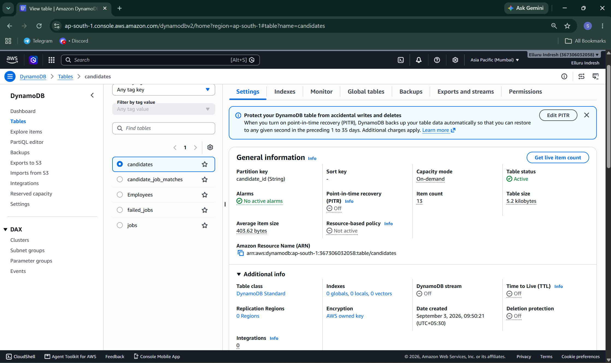
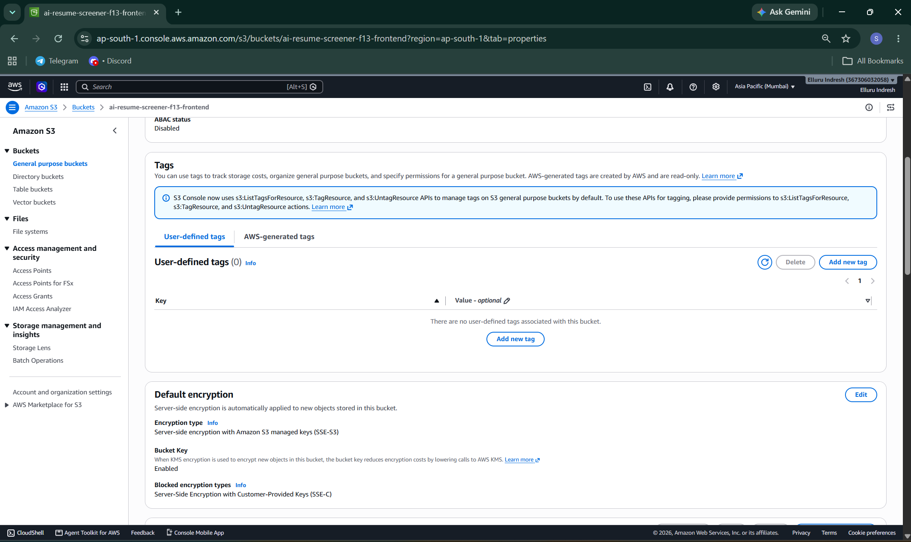
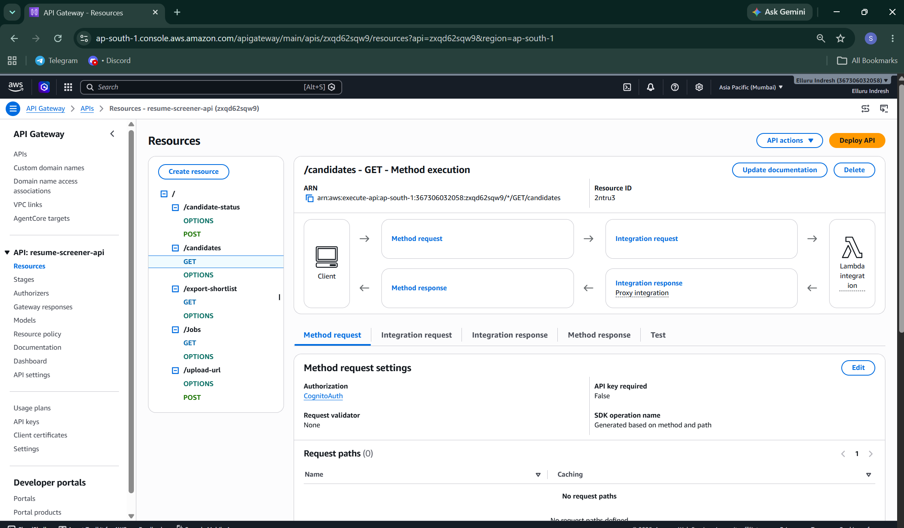
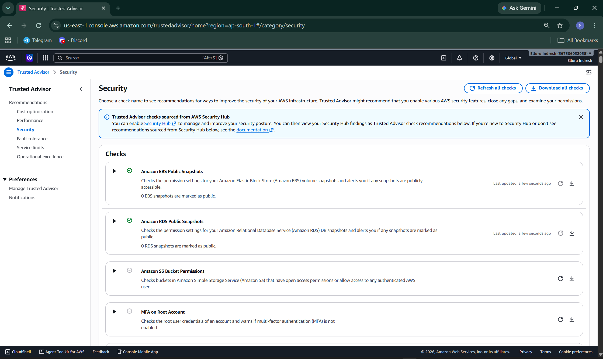

# Security Hardening Audit & Compliance Report

This document verifies the production hardening standards enforced across all 4 microservice projects, covering encryption at rest, API Gateway authentication controls, and AWS Trusted Advisor security checks.

---

## 1. Storage & Database Encryption at Rest

All primary persistent storage components across the 4 microservices were audited to guarantee that encryption at rest is enforced.

### DynamoDB Table Encryption
- **Scope:** Candidate resumes, employee records, and leave management tables.
- **Status:** Enabled (Default AWS-owned / KMS encryption keys active).
- **Verification Evidence:**
  

### S3 Bucket Default Encryption
- **Scope:** Frontend hosting and document upload storage buckets.
- **Status:** Enabled (Server-side encryption SSE-S3 / SSE-KMS with Bucket Key enabled to optimize KMS costs).
- **Verification Evidence:**
  

---

## 2. API Gateway & Cognito User Pool Authorization

To prevent unauthenticated public access, all API endpoints are enforced behind Amazon Cognito User Pool Authorizers.

- **Authorizer Name:** `CognitoAuth`
- **Target API:** `resume-screener-api` (`zxqd62sqw9`)
- **User Pool ID:** `ap-south-1_EzkBjeHzR`
- **Token Source:** `Authorization` header
- **Verification Evidence:**
  

---

## 3. AWS Trusted Advisor Security Audit

An automated scan using AWS Trusted Advisor was executed to validate the environment against AWS Well-Architected security best practices.

### Findings & Remediations
1. **Amazon EBS Public Snapshots:** Compliant (0 public snapshots detected).
2. **Amazon RDS Public Snapshots:** Compliant (0 public snapshots detected).
3. **Amazon S3 Bucket Permissions:** Verified bucket ACLs and Block Public Access policies to ensure no unauthorized public access to sensitive backend buckets.
4. **MFA on Root Account:** Verified identity policies and access safeguards across operational accounts.

### Verification Evidence
